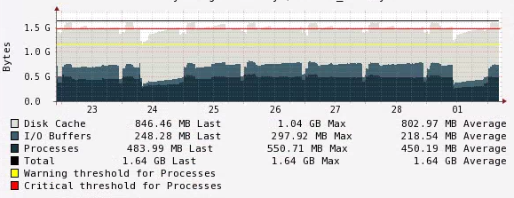

linux-check-mem-nagios-plugin
=============================

Nagios plugin that measures Linux memory use as reported by the '/proc/meminfo' output.
A PNP4Nagios graph template is include to combine the figures on a single chart.



This is plugin is based on one [published on the Nagios Exchange](http://exchange.nagios.org/directory/Plugins/System-Metrics/Memory/check_mem-2Esh/details) by Lukasz Gogolin <lukasz.gogolin@gmail.com>
This repo is a copy of version 1.1 released 2012-07-22 and modified by @whereisaaron.
This version 1.4 has contributions by @whereisaaron, @DavidGoodwin, @eacmen.

The changes aim to improve performance (fewer forks) and the PNP4Nagios chart.

Sample install steps below are for CentOS 6.5 and assume you are using nagio with check_nrpe plugin, nrpe, and pnp4nagios.

1) Install and configure nagios, nrpe, and the check_nrpe nagios plugin

2) Install the files for this plugin and chart
```
cp check_mem.php /usr/share/nagios/html/pnp4nagios/templates/
cp check_mem /usr/lib64/nagios/plugins/
/sbin/restorecon -v /usr/lib64/nagios/plugins/check_mem
```

3) Now add the command to NRPE configuration /etc/nagios/nrpe.config
```
command[check_mem]=/usr/lib64/nagios/plugins/check_mem -w 70 -c 90
```

4) Reload NRPE  
```  
service nrpe reload
```

5) Test manually
```
/usr/lib64/nagios/plugins/check_nrpe -H target.host.name -c check_mem
```

6) Now go configure the service or service template in Nagios and use as required
```
	define service {
			name                            check-nrpe-linux-mem
			service_description             Check Linux memory
			use                             generic-service
			check_command                   check_nrpe!check_mem
			max_check_attempts              1
			check_interval                  5
			retry_interval                  1
			register                        0
	}
```

The pnp4nagios template name assumes you have 
[pnp4nagios configured with `CUSTOM_TEMPLATE = 1`](http://docs.pnp4nagios.org/pnp-0.6/tpl_custom?s[]=custom),
if not you may need to change this filename so that it matches. If you find that you get multiple 
charts instead of one, the template name is probably not matching.


